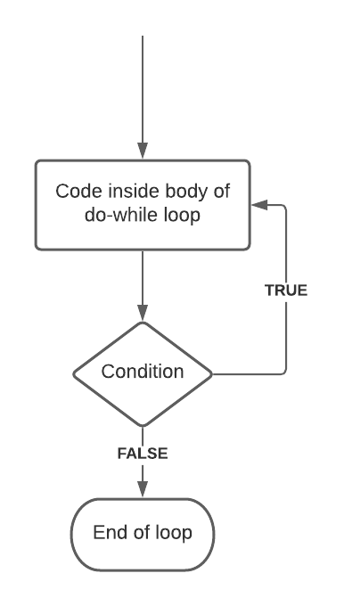

# JavaScript Loops

Loops perform repetitive actions so we don’t have to code that process manually every time.


How to write `for` loops with an iterator variable that increments or decrements

```javascript
for(let i = 10; i < array.length; i--)
```


How to use a `for` loop to iterate through an array

```javascript
myArray = [1, 2, 3, 4, 5];

for (let i = 0; i < myArray.length; i++) {
    console.log(myArray[i])
};

>>> 1
>>> 2
>>> 3
>>> 4
>>> 5
```


A nested `for` loop is a loop inside another loop

```javascript
myArray = [1, 2, 3, 4, 5];

for (let i = 0; i < myArray.length; i++) {
    for (let j = 0; j < myArray.length; j++) {
        console.log('Loop ' + i);
    }
};

>>> Loop 0
>>> Loop 0
>>> Loop 0
>>> Loop 0
>>> Loop 0
>>> Loop 1
>>> Loop 1
>>> Loop 1
>>> Loop 1
>>> Loop 1
>>> Loop 2
>>> Loop 2
>>> Loop 2
>>> Loop 2
>>> Loop 2
...
```


`while` loops allow for different types of stopping conditions

Stopping conditions are crucial for avoiding infinite loops.

```javascript
myArray = [];

while (myArray.length < 4) {
    myArray.push('Number ' + myArray.length);

};

console.log(myArray)

>>> [ 'Number 0', 'Number 1', 'Number 2', 'Number 3' ]
```


`do-while` loops run code at least once— only checking the stopping condition after the first execution

```javascript
let result = '';
let i = 0;

do {
  i = i + 1;
  result = result + i;
} while (i < 0);

console.log(result);

>>> 1
```




The `break` keyword allows programs to leave a loop during the execution of its block

```javascript
myArray = [];

while (myArray.length < 4) {
    if (myArray.length === 2) {
        break;
    } else
        myArray.push('Number ' + myArray.length);
};

console.log(myArray)

>>> [ 'Number 0', 'Number 1']
```

