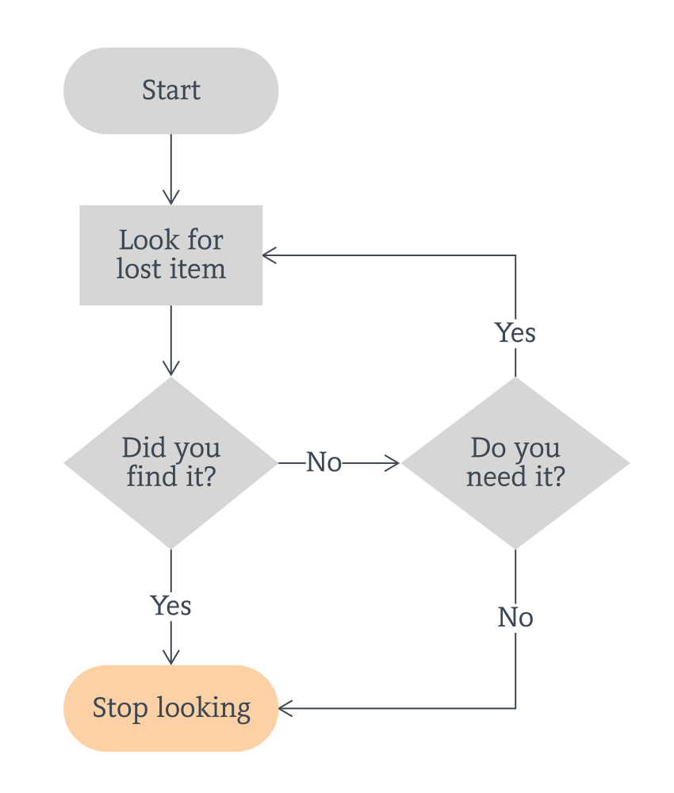

# FlowCharts

A flowchart is a type of diagram that represents a workflow or process. A flowchart can also be defined as a diagrammatic representation of an algorithm, a step-by-step approach to solving a task.

In the flow charts we have several icons approved by the ISO in 1985. generally the FlowCharts flow fromm top to bottom and left to right. 

The most used symbols in flowcharts and the meaning are:

Shows the process's order of operation. A line coming from one symbol and pointing at another. Arrowheads are added if the flow is not the standard top-to-bottom, left-to right.

Indicates the beginning and ending of a program or sub-process. Represented as an oval or rounded \(fillet\) rectangle. They usually contain the word "Start" or "End", or another phrase signaling the start or end of a process, such as "submit inquiry" or "receive product".

Represents a set of operations that changes value, form, or location of data. Represented as a rectangle.

Shows a conditional operation that determines which one of the two paths the program will take. The operation is commonly a yes/no question or true/false test. Represented as a diamond \(rhombus\).

