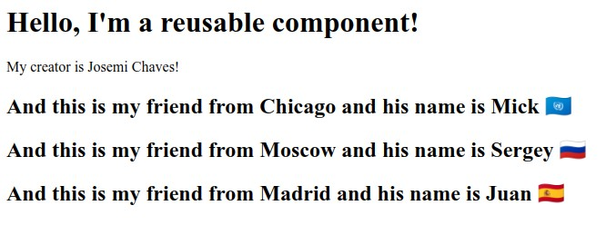
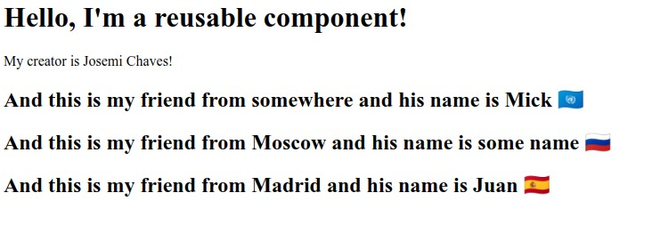

# React Components

A component is a piece of independent reusable code.


We can define a component in two ways:

Using a JavaScript class

```jsx
import React from 'react';
import ReactDOM from 'react-dom';

class MyComponent extends React.Component {
    render() {
        return <h1> Hello, I'm a reusable component!</h1>;
    }
}

ReactDOM.render(<MyComponent />, document.getElementById('root'))
```

Or using a JavaScript Function, which is the simplest and most used way actually

```jsx
function MyComponent(props) {
    return (
        <>
            <h1> Hello, I'm a reusable component!</h1>
            <p>My creator is {props.name}!</p>
        </>
    )
}


```

The do exactly the same


For rendering a component we need to call it

```jsx
import React from 'react';
import ReactDOM from 'react-dom';

function MyComponent(props) {
    return (
        <div>
            <h1> Hello, I'm a reusable component!</h1>
            <p>My creator is {props.name}!</p>
        </div>
    )
}

ReactDOM.render(<MyComponent name="Josemi" />, document.getElementById('root'))
```


The `props` are the arguments passed in the function, when we use `class` we need to refer it using the `this`keyword, but if we do it with the `function` we don't need to use the `this`. We give the value to our `props` when we call the component.


We can use components inside another components, and also conditional statements

```jsx
import React from 'react';
import ReactDOM from 'react-dom';

function MyComponent(props) {
    return (
        <>
            <h1> Hello, I'm a reusable component!</h1>
            <p>My creator is {props.name}!</p>
        </>
    )
}

function Friend(props) {
    let flag;
    if (props.city === "Moscow") {
        flag = "🇷🇺"
    } else if (props.city === "Madrid") {
        flag = "🇪🇸"
    } else {
        flag = "🇺🇳"
    }
    return <h2>And this is my friend from {props.city} and his name is {props.friendName} {flag}</h2>

}

function FullMessage() {
    return (
        <>
            < MyComponent name="Josemi Chaves" />
            <Friend city="Chicago" friendName="Mick" />
            <Friend city="Moscow" friendName="Sergey" />
            <Friend city="Madrid" friendName="Juan" />
        </>
    )
}

ReactDOM.render(<FullMessage />, document.getElementById('root'))

```



We usually have a lot of components in a different archives, we can import and export them.



```jsx
import React from 'react';
import ReactDOM from 'react-dom';
import { Friend } from './friends'

function MyComponent(props) {
    return (
        <>
            <h1> Hello, I'm a reusable component!</h1>
            <p>My creator is {props.name}!</p>
        </>
    )
}

function FullMessage() {
    return (
        <>
            < MyComponent name="Josemi Chaves" />
            <Friend city="Chicago" friendName="Mick" />
            <Friend city="Moscow" friendName="Sergey" />
            <Friend city="Madrid" friendName="Juan" />
        </>
    )
}

ReactDOM.render(<FullMessage />, document.getElementById('root'))
```



```jsx
    import React from "react";

export function Friend(props) {
    let flag;
    if (props.city === "Moscow") {
        flag = "🇷🇺"
    } else if (props.city === "Madrid") {
        flag = "🇪🇸"
    } else {
        flag = "🇺🇳"
    }
    return <h2>And this is my friend from {props.city} and his name is {props.friendName} {flag}</h2>
}
```




Sometimes we expect a `prop` passed to display info, but if no info is passed, the app will show nothing, so we can set a default text if no `prop` is passed.




```jsx
import React from "react";

export function Friend(props) {
    let flag;
    if (props.city === "Moscow") {
        flag = "🇷🇺"
    } else if (props.city === "Madrid") {
        flag = "🇪🇸"
    } else {
        flag = "🇺🇳"
    }
    return <h2>And this is my friend from {props.city} and his name is {props.friendName} {flag}</h2>
}

Friend.defaultProps = {
    city: "somewhere",
    friendName: "some name"
}
```



```jsx

import ReactDOM from 'react-dom';
import { Friend } from './friends'

function MyComponent(props) {
    return (
        <>
            <h1> Hello, I'm a reusable component!</h1>
            <p>My creator is {props.name}!</p>
        </>
    )
}

function FullMessage() {
    return (
        <>
            < MyComponent name="Josemi Chaves" />
            <Friend friendName="Mick" />
            <Friend city="Moscow" />
            <Friend city="Madrid" friendName="Juan" />
        </>
    )
}

ReactDOM.render(<FullMessage />, document.getElementById('root'))
```





A `defaultProps` will be **always** an object.

